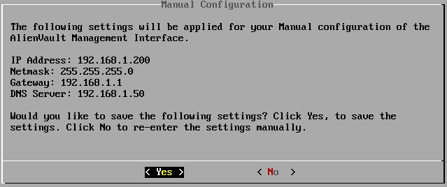
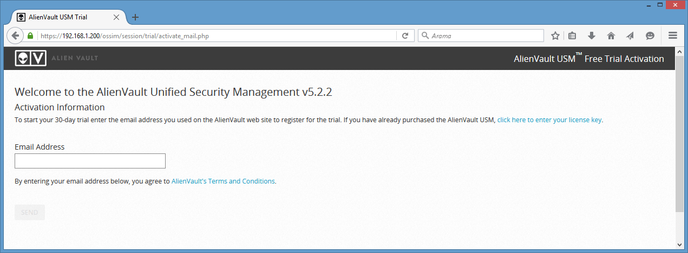

## AlienVault Kurulumu

AlienVault Unified Security Management (USM) gelişmiş tehditlere karşı etkili bir biçimde savunma yapabilmek için geliştirilmiş bütünleşik bir güvenlik yönetim sistemidir. AlienVault; Server, Sensor ve Logger olmak üzere üç temel bileşenden oluşur. Bu bileşenler tek başına kullanılabildiği gibi hepsi bir arada bütünleşik bir sistem olarakta kullanılabilmektedir. Bu temel bileşenler gerçek zamanlı olarak akıllı tehdit algılama, log kolerasyonu gibi  özellikler sağlar.

AlienVault’u oluşturan bu temel bileşenler;

Server: Sensörler tarafından gelen bilgileri toplar ve ilişkilendirir. Ayrıca bu bilgilerin tek bir ekrandan yönetim ve raporlanmasını sağlar. Güvenlik otomasyonu özelliği sayesinde gelen tehditlere karşı hızlıca yanıt verilmesini sağlar. Ortak yönetim sayesinde ağ güvenliğinin maliyet ve karmaşıklığınız azaltır. Akıllı tehdit algılama özelliği ile sürekli güvenlik zaafiyeti araştırma gereksinimini ortadan kaldırır.

Sensor: Ağınızda bulunan logları toplamak ve eksiksiz görüntülenebilmesi için sağladığı güvenlik özellikleri vardır. Bunlar Asset Discovery (Varlık Keşfi), Vulnerability Assessment (Zaafiyet Değerlendirme), Intrusion Detection (Saldırı Tespiti), Behavioral Monitoring (Davranışşal İzleme) ve SIEM şeklindedir.

Logger: Adli makamların olay araştırmalarında ihtiyaç duyduğu loglar, yasalara uygun şekilde dijital imza ile uzun süreli depolama ve ölçeklendirilebilir şekilde yapılabilir. Loglar 5te1 oranında sıkıştırılarak saklanır. Entegre log arama özelliği sayesinde aranılan loglar kısa sürede bulunabilir.

Kurulumdan sonra 5 adımdan oluşan yapılandırma işlemini gerçekleştirerek birkaç dakika içerisinde AlienVault’u kullanmaya başlayabilirsiniz.

1. Ağa Bağlanma: Yani USM ağa bağlanır ve trafiği inceleyerek ağ hakkında bilgi toplar.
2. Ağı Tarama: USM bağlı olduğu ağda bulduğu cihazları, servisleri, ve güvenlik açıklıklarını tarar.
3. Sistem & Network İzleme: USM ‘in testip etmiş olduğu tehdit ve kötü niyetli davranışları tespit eder ve grafik halinde sunar.
4. Log Toplama: Loglar toplanır.
5. Analiz Etme ve Çözüm: Tehdit içeren olaylar analiz edilerek çözüm üretilir.

      
AlienVault USM Sistem Gereksinimleri

Sistem gereksinimlerini sağlayan bir alt tapı hazırlanarak kurulum işlemi aşağıdaki adımlar takip edilerek gerçekleştirilebilir.

30 günlük ücretsiz deneme sürümünü şu adresten indirebilirsiniz.

#### AlienVault USM Kurulumu

-Sistemi başlatınız. AlienVault kurulum ekranı açılacaktır. İlk olarak network yapılandırma türünü seçiniz. Burada manuel seçim yapılmış olup IP adress, Netmask, Gateway, DNS gibi bilgiler girilmiştir. İlgili ayarları kendi ağınıza göre yapınız.

    

    

- Kurulum işlemi tamamlanırken bekleyiniz.
- Kurulum işlemi tamamlandıktan sonra kullanıcı bilgilerinin yer aldığı ekran açılacaktır. İlk olarak bu ekranda yer alan bilgiler ile sisteme giriş yaparak root parolanızı değiştiriniz.

    

- Web tarayıcısı üzerinden belirlediğiniz IP adresine erişim sağlayınız. Aktivasyon işlemi için eposta adresini yazarak devam ediniz. Ve işlemi “FINISH” diyerek tamamlayınız.

    

    

- AlienVault için yetkili kullanıcı hesap bilgilerini yazınız.

    

- AlienVault ‘a erişim sağlayabilirsiniz. Kullanıcı bilgilerinizi yazarak giriş yapınız.

    

- Açılış ekranında başlangıç sihirbazı ile ilk yapılandırmanızı gerçekleştirebilirsiniz. “START” diyerek sihirbazı başlatınız.

    

- Network yapılandırmanızı gerçekleştiriniz.

    

- AlienVault bulunduğunuz networkü tarayarak aktif sunucuları listeler. Bu listede izlemek istemediğiniz sunucular varsa o sunucuları kaldırarak devam ediniz.

    

- İzlemek istediğiniz Linux/Windows sistemlere Host Intrusion Detection System (HIDS) kurulumunun yapılabilmesi için kullanıcı bilgilerinizi yazarak “DEPLOY” butonuna basınız. Bu işlemi Linux ve Windows sistemleriniz için ayrı ayrı gerçekleştirmeniz gerekmektedir. (Bu yazıda 1 Linux ve 1 Windows eklenmiştir.)

    

    

-İşlemin tamamlanması için devam ediniz.

    

- Bulunduğuz ağdaki network cihazlarına ait logları takip etmek isterseniz bu ekranda listelenecek olan aygıtlarınızı ekleyebilir veya bu adımı atlayabilirsiniz.

    

- Varsa OTX hesabınızı ekleyebilirsiniz.

    

- FINISH butonuna basarak sihirbazı kapatabilirsiniz.

    

- AlienVault’a erişim için “EXPLORE ALIENVAULT USM” linkine tıklayınız.

    

- AlienVault Dashboard ekranı açılacaktır.

    

- Kurulum işlemi tamamlandıktan sonra sisteme eklediğiniz Linux ve Windows sunuculara HIDS’in sorunsuz yüklendiğiniz kontrol ediniz. Environment >> Detection >> Agents bölümünden kontrol edebilirsiniz.

    

- Bazı durumlarda HIDS’in kurulumunda problem olabilir. Bu gibi durumlarda HIDS’i sizin yüklemeniz gerekebilir.