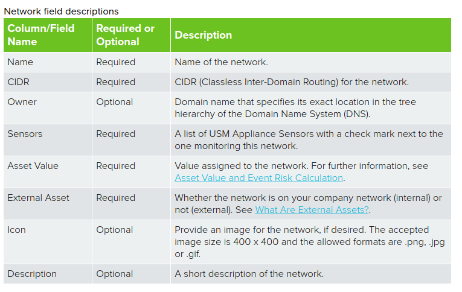

## Network Tanımlanması

- ` Environment > Assets & Groups > Networks` sayfası açılır.
- Sağ üst köşedeki `Add Network` menüsünden `Add Network` seçilir.
- Açılan penceredeki alanlar, aşağıdaki bilgilere uygun olarak doldurulur.
- `Save` tıklanarak çıkılır.

    

