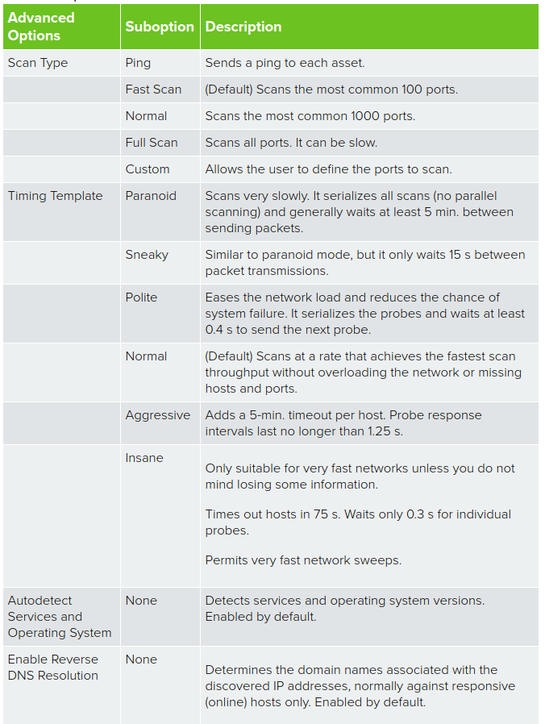
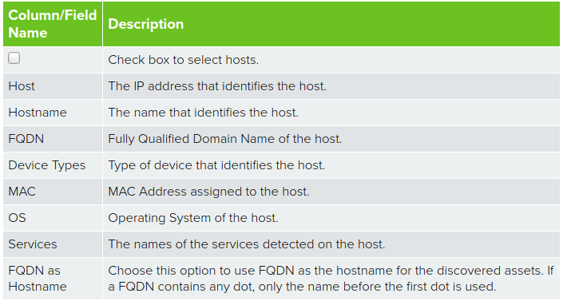

## Asset Taraması Yapma

- `Environment > Assets & Groups > Assets` sayfasına gidilir.
- Sağ üst tarafta bulunan `Add Assets` menüsünden `Scan For New Assets` tıklanır.
- Asset seçilir.
- Sensör seçilir.
- Tarama yapılırken doldurulması gereken alanlarla ilgili bilgiler aşağıdaki tabloda verilmiştir:

    

- `Start Scan` tıklanarak tarama işlemi başlatılır.
- Tarama tamamlandığında, sonuçlar aynı sayfada, `Start Scan` butonunun altında görünür.
- `Update Managed Assets` tıklanarak, bulunan assetler kaydedilir.
- Çıkan sonuçlardaki bilgiler için aşağıdaki tabloya bakılabilir.

    

