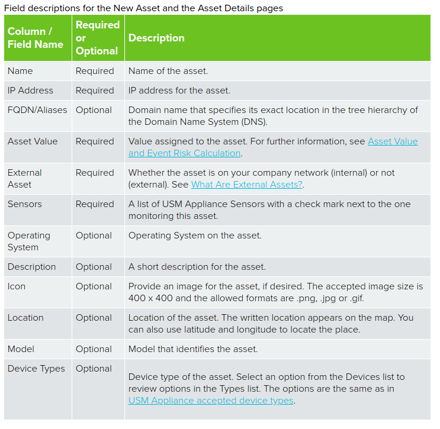

## Manuel Asset Ekleme

- `Environment > Assets & Groups > Assets` yoluna gidilir.
- Sağ üst tarafta bulunan `Add Assets` menüsündeki `Add Host` tıklanır.
- Gelen sayfadaki asset bilgileri doldurulur.
- Sayfa kaydedilip çıkılır.

Asset eklerken isimlendirmede aşağıdaki kurallara uyulmalıdır.

- Cannot contain any dot (.).
- Cannot start or end with a dash (-).
- Cannot contain a space.
- Can start or end with a letter or a number.
- Can only contain up to 63 characters.

Asset bilgileri girilirken aşağıdaki tablo dikkate alınmalıdır.

    

