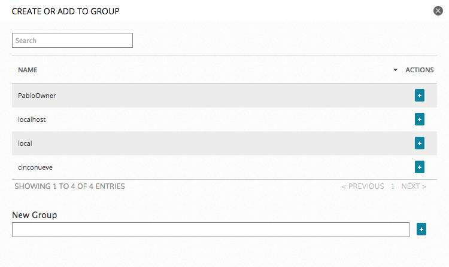
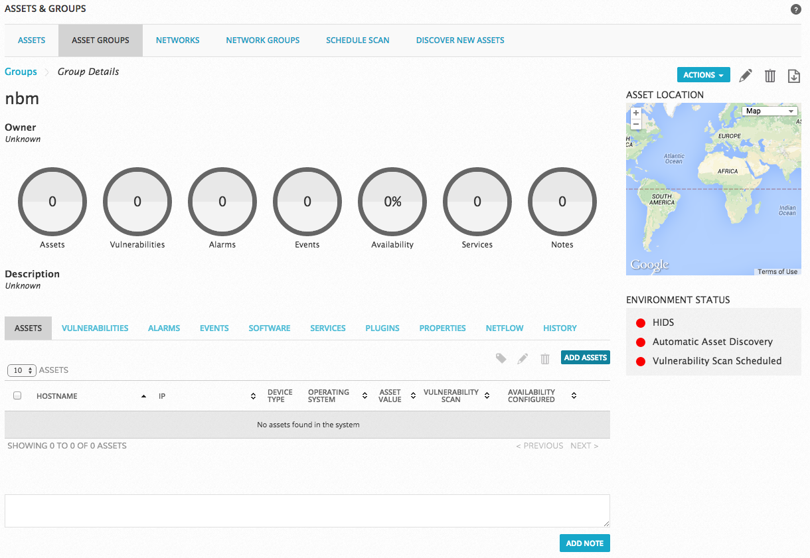

## Asset Gruplarının Oluşturulması

Asset grupları iki şekilde oluşturulabilir:

- Asset listesinden assetlerin seçilip grup oluşturulması
- Asset grup sayfasından önce asset grubu oluşturulup sonra assetlerin eklenmesi

#### Asset listesinden grup oluşturulması

- `Environment > Assets & Groups > Assets` sayfasına gidilir.
- İlgili assetler seçilir. 
- `Actions` menüsünden `Create / Add to Group` butonuna tıklanır.
- Gelen sayfadan yeni grup oluşturulabilir veya ilgili assetler daha önce oluşturulmuş bir grup üzerine eklenebilir.

    

#### Asset grupları sayfasından oluşturma

- `Environment > Assets & Groups > Asset Groups` sayfasına gidilir.
- Sağ taraftaki `Create New Group` butonuna tıklanır.
- İsim ve açıklama girilerek grup kaydedilir.
- Sonrasında asset grubun sayfası açılır.

    

- Sağ üst taraftaki `Add Assets` butonuna tıklanır.
- Açılan `Add Assets to Group` penceresinden eklenmek istenen assetler eklenir.
- Sayfa kaydedilir.