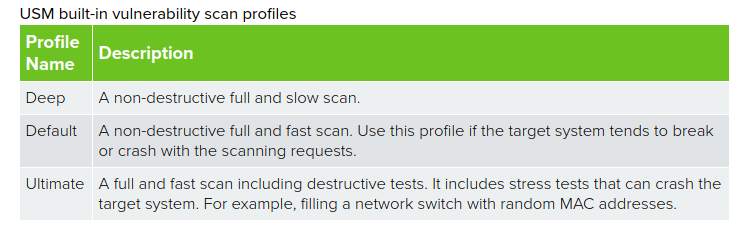
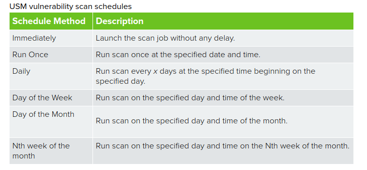

## Vulnerability scan

- `Environment > Assets & Groups > Assets` yoluna gidilir.
- Taranacak assetler seçilir.
- `Actions > Run Vulnerability Scan` seçilir.
- `Job Name` kısmına yeni bir isim verilir.
- `Select Sensor` kısmından sensor seçilir.
- `Profile` kısmından profil seçilir.

    

- `Schedule Method` kısmından zamanlama seçilir.

    

- Opsiyonel olarak `Advanced` ayalarlamalar yapılabilir.
- `Save` ile kaydedilir.