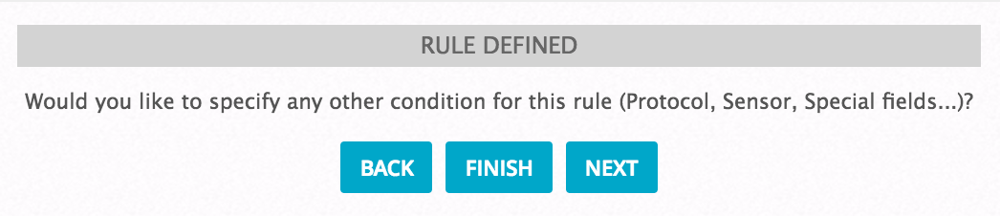

## Kolerasyon Yazılması

- Ossimde korelasyon kuralı oluşturmak için Web arayüzünden `Configuration >> Threat Intelligence >> Directives` sekmesi açılarak `New Directive` butonuna basılır.

- Korelasyonun için isim yazılır ve Intent, Stragegy, Method ve Priority değeri belirlenir.

    

- Korelasyonu tetikleyecek olan ilk kuralın ismi yazılır.

    

- Event tipi seçilir.

    

- İlgili alt event seçilir

    

- Kaynak ve hedef adresler belirlenir.

    

- Reliability değer seçilir.

**NOT!** : AlienVaultta risk hesaplaması `priority * reliability * asset_value / 25` olarak hesaplanır. Sonuç 1 ‘den büyükse alarm üretilir.

- Risk kategorileri :
    - 0,1,2 = Low
    - 3,4 = Precaution
    - 5,6 = Elevated
    - 7,8 = High
    - 9,10 = Very High

    

- Finish butonuna tıklanarak ilk kuralın oluşturulması tamamlanır.

    

- İlk kural oluştuktan sonra oluşması beklenen ikinci kuralı tanımlamak için Action sekmesindeki + butonuna tıklanır.

    

- İkinci kuralın adı girilir.

    

- Event tipi seçilir.

    

- İlgili alt event seçilir

    

- Kaynak ve hedef adresler seçilir. Bir önceki kuraldaki kaynak ve hedef ile eşleşmesi isteniyorsa “From a parent rule” kısmından aşağıdaki görüntüdeki gibi seçim yapılır.

    

- Reliability değeri seçilir.

    

- Kuralın oluşturulması tamamlanır.

    

- İlk kural oluştuktan sonra ikinci kuralın oluşması için beklenilecek süre belirlenir.

    

- İlk kural oluştuktan sonra ikinci kuralın kaç kez oluşması gerektiği belirlenir.

    

- İşlemler tamamlandıktan sonra “Restart Server” butonuna basılır. (restart etmeden önce “test directives” butonuna basarak oluşturduğunuz korelasyok kurallarında hata olup olmadığını test edebilirsiniz.)

    

 

#### Kuralın Test Edilmesi

- `Analysis >> Alarms` bölümünden  oluşan alarmlar takip edilir.

- İlk kuralın tetiklenmesi sağlanır. (nmap ile tarama yapılarak oluşturulabilir)

- İlk tarama sonrası alarmın oluştuğu ve risk seviyesinin 1 olduğu gözlemlenir.

    

- 1 dakika içerisinde 2 adet başarısız ssh erişimi aktivitesi yapılarak korelasyonun çalışması ve risk değerinin 2 ‘ye yükselmesi gözlemlenir.

    

- Ayrıca yapılan bu işlemlerin tamamına Analysis >> SIEM bölümünden ulaşılabilir.

    

